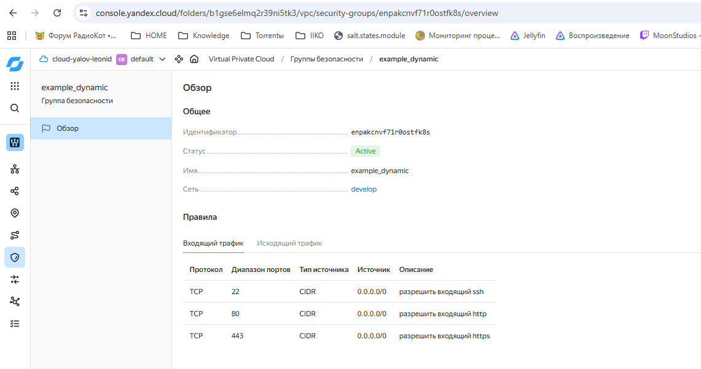
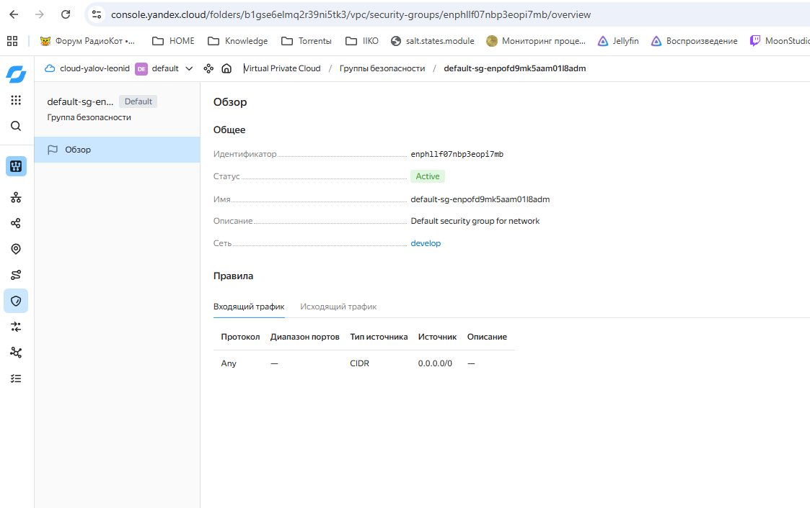
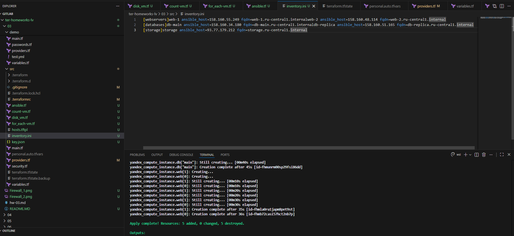

Домашнее задание к занятию «Управляющие конструкции в коде Terraform»
Ялова Л.В

Задание 1
Изучите проект.
Инициализируйте проект, выполните код.
Приложите скриншот входящих правил «Группы безопасности» в ЛК Yandex Cloud .

Задание 4 
Ответ4 
